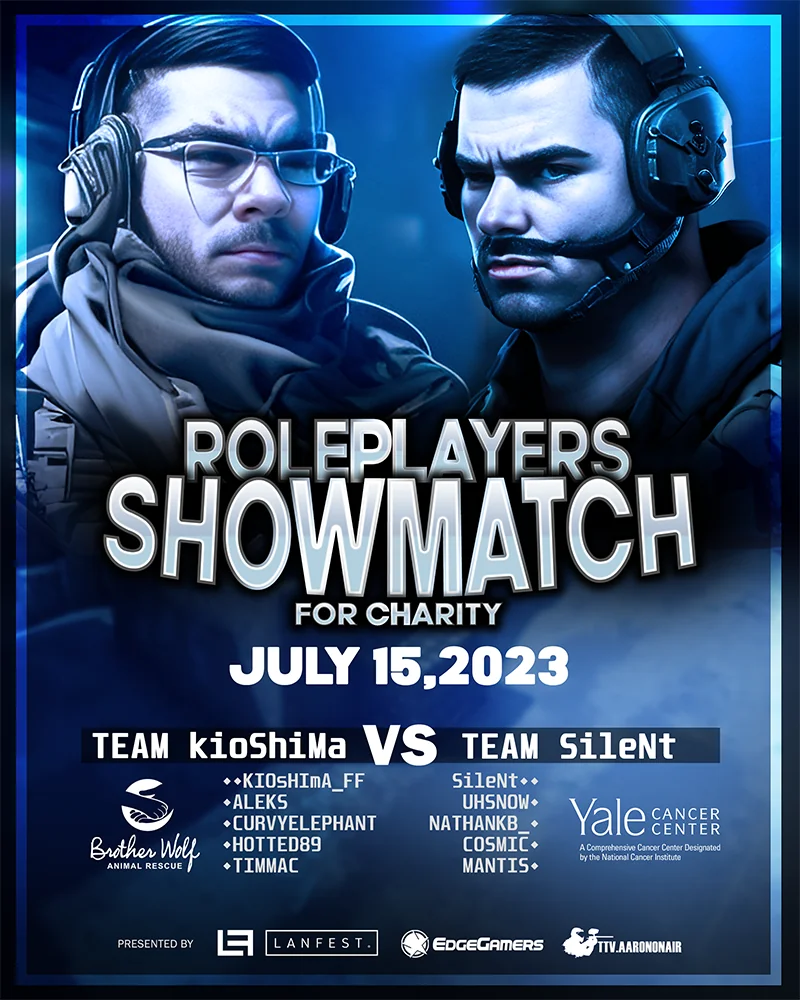

# DonorDrive API

This is a simple DonorDrive API for Sourcemod developed for the [LANFest Charity Stream](https://lanfest.donordrive.com/index.cfm?fuseaction=donorDrive.event&eventID=575) that raised $8,165 for the Yale cancer center and the Brother Wolf animal shelter.

The sources do not have git history as they were extracted from a larger repository. Several of the plugins have dependencies that may need to be removed for your use case.

While not required, please credit us somewhere in your production if this ends up being useful to you. Edgegamers is always looking for interesting ways to engage with other gaming communities—Don't hesistate to reach out to us at [edgegamers.com](https://edgegamers.com) if you have something in the works.

## Dependencies

- `Rest In Pawn` with `HTTPRequest` support
- `Colorlib` (included)

For built-in plugins:
- `Get5` (Crazy Match)
- `Cstrike` (Donor Log and Crazy Match)

## Usage

See [`scripting/donordrive_log.sp`](scripting/donordrive_log.sp) for example usage. A simplified version of the forwards and methodmaps is available below.

To use the "crazy" match plugin, it's best to run your tournament with Get5 or another organization system which handles the ambiguity of which team is which.
Make sure to fill out convars with the proper incentive IDs or they will not register.

To test, the command `sm_dd_reset` will reset the entity cache and etag system, allowing you to replay the entire donation history all at once.

## About us

EdgeGamers is a multi-game community that hosts Minecraft, FiveM, CS:GO, TF2, Rust, and Day of Defeat: Source servers. If you like what we do and want to help, you can join our volunteer tech team using [this application](https://www.edgegamers.com/threads/318139/), or learn how to get involved as a plain old player [here](https://www.edgegamers.com/pages/registration/).

## API

### `public void OnDonation(Donation donation)`

This forward is invoked every time a new donation is detected. 
The `Donation` object passed is a methodmap around the DonorDrive response object.

### `methodmap Donation`

```c++
//  A unique identifier for this donation
public bool GetDonationID(char[] buffer, int maxlen)

public bool GetCreatedTimeUTC(char[] buffer, int maxlen)
//  Amount
//  May be hidden by donor.
property bool HasAmount { get}

property float Amount { get }

//  Team ID
//  Present if a team was selected for this donation.
//  Teams are arbitrary numbers--See https://github.com/DonorDrive/PublicAPI/blob/master/resources/teams.md
property bool HasTeamID { get }

property int TeamID { get }

//  Incentive ID
//  Present if this donation has an incentive attached
property bool HasIncentiveID { get }

public bool GetIncentiveID(char[] buffer, int maxlen)

//  Returns true if this is an incentive with id "incentiveid".
public bool IncentiveIs(char[] incentiveid)

//  Returns true if this is an incentive with the value matching the 
//  value of the provided convar.
public bool IncentiveIsVar(ConVar cvar)

//  Message
//  Donor-supplied message. May be hidden by donor.
property bool HasMessage { get }

public bool GetMessage(char[] buffer, int maxlen)

//  Display name
//  Donor-supplied name. Can be anonymous.
property bool IsAnonymous { get }

public bool GetName(char[] buffer, int maxlen) 
```

